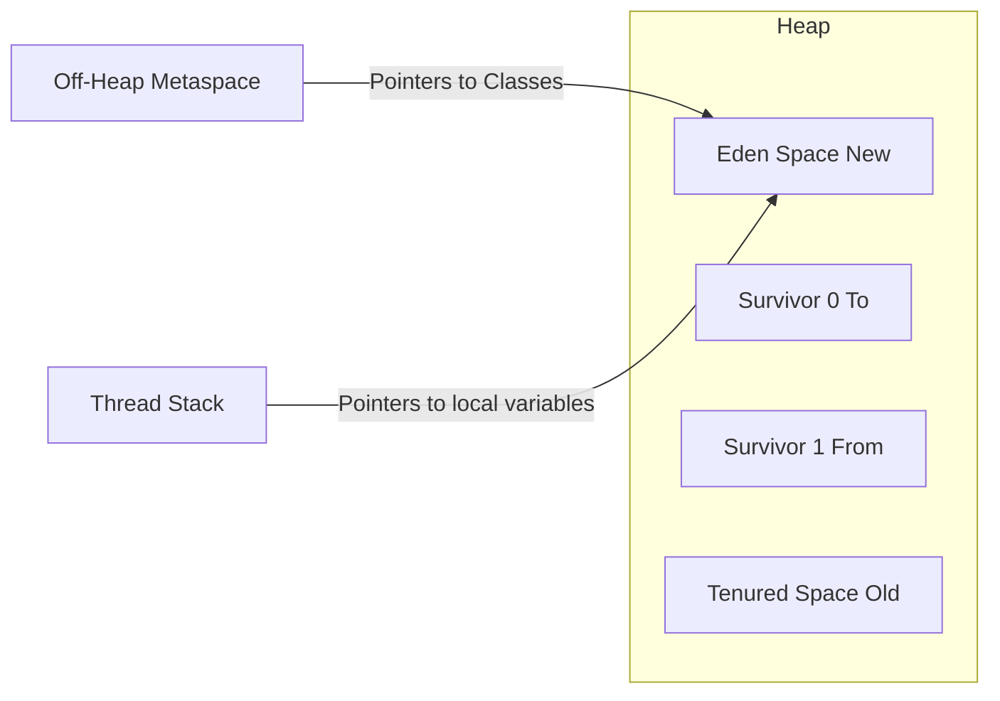
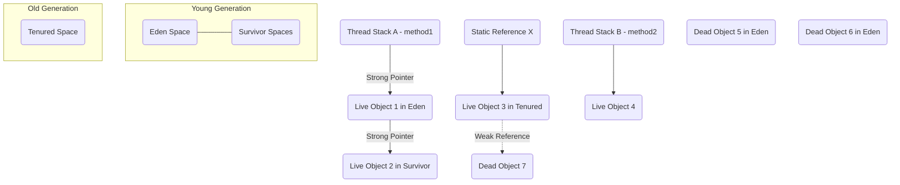

# JVM Garbage Collection

## Choosing a Collector: G1GC vs ZGC vs Shenandoah

**Compare G1GC, ZGC, and Shenandoah — when would you pick each for a production service?**

G1GC is the default since Java 9: region-based, targets predictable pause times, good general-purpose choice for heaps up to ~32GB. Pick G1GC for typical REST APIs and batch services where a few hundred ms of occasional pause is acceptable and you want mature, well-understood tuning knobs.

ZGC and Shenandoah are low-latency collectors targeting sub-millisecond pauses even on multi-terabyte heaps, using concurrent evacuation. Pick ZGC/Shenandoah for latency-sensitive services (trading systems, real-time bidding) where p99 pause time matters more than throughput.

---

## Internal Working

Java Garbage Collection (GC) is an automatic process managed by the Java Virtual Machine (JVM) that frees up memory by destroying objects that are no longer reachable or used by the application.

Unlike languages like C or C++, where you have to manually allocate and free memory, Java handles this for you behind the scenes, preventing memory leaks and saving you from a lot of manual debugging.

Here is a deep dive into how it works internally:

### 1. The Generational Hypothesis

**JVM Garbage Collection is built on the Generational Hypothesis**: the observation that most objects created in an application have a very short lifespan (e.g., local variables inside a method).

To optimize this, the JVM heap memory is divided into different generations based on the age of the objects.

#### The Young Generation

This is where all newly created objects are allocated. It is designed for frequent, fast garbage collection. It is subdivided into:

- **Eden Space**: The initial landing pad for new objects.
- **Survivor Spaces (S0 and S1)**: Two equal-sized spaces used to hold objects that survived a collection cycle in the Eden space. One is always designated as "From" and the other as "To", alternating roles each cycle.

#### The Old (Tenured) Generation

This space holds long-lived objects that have survived multiple garbage collection cycles in the Young Generation. It is typically much larger than the Young Generation and is collected less frequently.

### 2. Internal Mechanism: How GC Works Step-by-Step

The internal process relies heavily on tracking "reachability" and moving objects between these memory pools.

#### Step A: Marking (Reachability Analysis)

The GC needs to figure out which objects are still in use and which can be deleted. It uses a technique called **Reachability Analysis**.

- The GC starts at specific root objects called **GC Roots** (e.g., active thread stacks, local variables, static variables, JNI references).
- It traverses the object graph from these roots.
- Any object that can be reached from a GC Root is marked as **Live**.
- Any object that cannot be reached is considered **Dead** and eligible for collection.

#### Step B: Minor GC (Cleaning the Young Generation)

When the Eden space fills up, a Minor GC is triggered.

- The JVM stops application threads briefly (a minimal "Stop-the-World" pause).
- It scans the Young Generation and identifies live objects.
- Live objects from Eden and the active Survivor space (e.g., S0) are copied over to the empty Survivor space (e.g., S1).
- The age counter of these surviving objects is incremented by 1.
- Eden and S0 are cleared entirely.
- For the next round, S0 and S1 swap roles.

#### Step C: Promotion

Objects that survive multiple rounds of Minor GC and reach a certain age threshold (called the **tenuring threshold**, which defaults to 15 in many JVMs) are "promoted" to the Old Generation.

#### Step D: Major GC / Full GC (Cleaning the Old Generation)

When the Old Generation becomes full, a Major GC (or Full GC, which cleans the entire heap) is triggered. Because the Old Generation is much larger, scanning it takes more time, leading to longer "Stop-the-World" pauses. It typically uses algorithms like **Mark-Sweep-Compact**:

- **Mark**: Identify live objects.
- **Sweep**: Delete dead objects.
- **Compact**: Move all live objects together at the beginning of the memory space to eliminate memory fragmentation.

---

## Types of Garbage Collectors

The JVM offers different GC algorithms depending on your application's needs (e.g., maximizing throughput vs. minimizing latency):

| Garbage Collector | Target Goal | How it Works | Best Used For |
|---|---|---|---|
| Serial GC | Simplicity | Uses a single thread for all GC operations. Pauses application execution completely during GC. | Small, single-threaded client applications. |
| Parallel GC (Throughput Collector) | High Throughput | Uses multiple threads for Young Generation GC to speed up processing. | Batch processing jobs where pauses don't impact user experience. |
| G1 (Garbage-First) GC | Low Pause / Predictable | Divides the heap into many small, equal regions. It targets regions with the most "garbage" first. | Large heap applications requiring predictable, low latency. (Default since Java 9). |
| ZGC / Shenandoah | Ultra-Low Latency | Performs almost all GC work concurrently with application threads, keeping pauses under a few milliseconds. | Massive heaps (gigabytes to terabytes) where pause times must be virtually imperceptible. |

---

## Mental Model of Garbage Collection

Think of the JVM heap as a multi-stage filter system. Objects start as temporary 'guesses' and must 'prove' their longevity to survive being cleaned out by the frequent, high-throughput Minor GC cycles. If they live long enough, they are promoted to a more stable, large-capacity 'tenured' area, which is cleaned less frequently but more aggressively by Major GC. The primary mechanism for survival is being part of a connected path (the object graph) rooted in a known-active source (the GC Root).

### Memory Architecture (The Arena)

We first establish the physical layout of the JVM heap where the action happens.

**Key Points:**

- **Eden**: Most new objects land here. Very fast allocation.
- **Survivor Spaces (S0/S1)**: Only objects that survive a Minor GC cycle end up here.
- **Tenured (Old Gen)**: The final home for long-lived objects, promoted after multiple surviving generations.

### Step 2: Minor GC Cycle (The Frequent Filter)

This is the main loop for objects. It runs frequently, pausing application threads briefly ("Stop-the-World").

**Internal Workflow of Step 2:**

1. **Marking**: Identify objects in Eden and the current From space (S1) that are reachable from GC Roots (like active stack variables). They are marked 'LIVE'.
2. **Copying**: All LIVE objects are moved directly from Eden and S1 to the To space (S0). Their age counter increments.
3. **Promotion (if threshold met)**: If an object in S1 is already old enough (the Tenuring Threshold), it is promoted to the Tenured space instead of S0.
4. **Clearing**: Eden and S1 are instantly cleared, reclaiming massive memory.
5. **Swap**: S0 and S1 switch logical roles for the next Minor GC cycle.

### Step 3: Major GC Cycle (The Deep Clean)

This is triggered less frequently, often when the Tenured space is near full. It can cause significant application pauses.

**Internal Workflow of Step 3 (The Mark-Sweep-Compact Model):**

1. **Marking**: A full scan of the entire heap (both Young and Old generations) to identify all objects reachable from GC Roots. This is the longest phase.
2. **Sweeping**: Deleting all memory locations marked as unreachable (garbage). This can leave fragmentation.
3. **Compacting (Optional but typical)**: Moving all remaining live objects together at the start of the memory block, eliminating fragmentation and creating contiguous free space. This requires updating all internal object references (re-pointing).

### Key Visualizing Elements (Pointers and References)

A critical part of the mental model is why some objects survive. It's about being connected.

**Understanding the Marking Pointers:**

- **Strong Pointer (Solid)**: If an object can be reached by traversing solid lines from any GC Root (R1, R2, R3), it is LIVE. Objects O1, O2, O3, O4 are all live.
- **Reachable vs Unreachable**: Object O7 is referenced weakly by O3. When GC runs, O3 is saved, but O7 will be collected because a Weak Reference doesn't block collection — this happens on any GC cycle in which O7 is otherwise unreachable, regardless of memory pressure (that memory-pressure-dependent behavior belongs to `SoftReference`, not weak references). Objects O5 and O6 have no path from a GC Root; they are dead.
